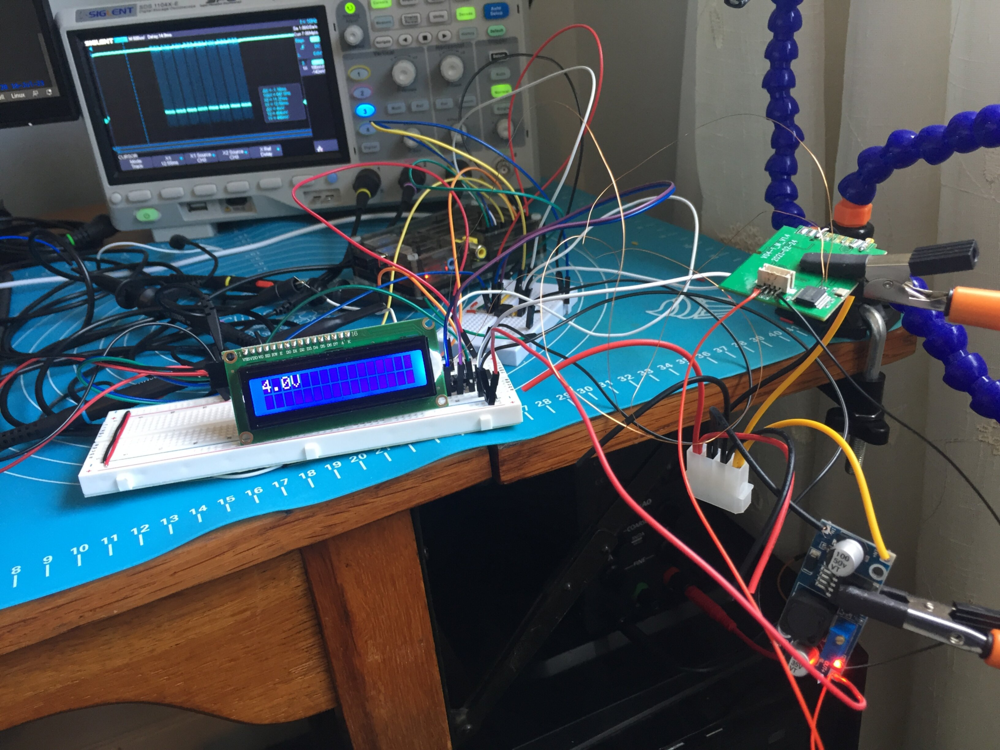
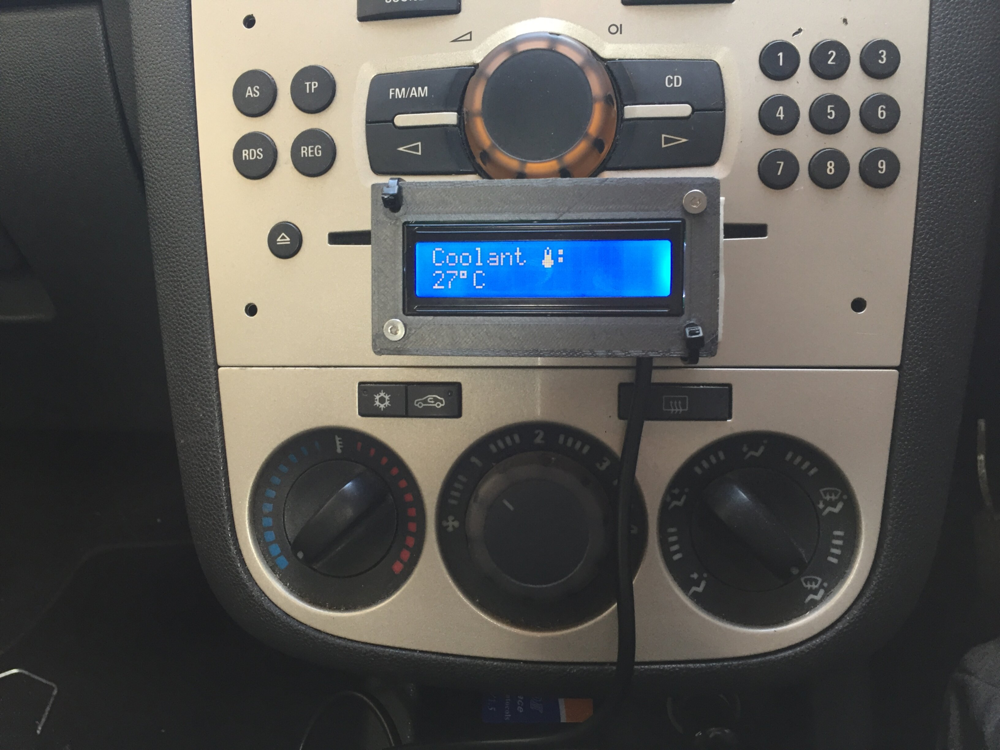
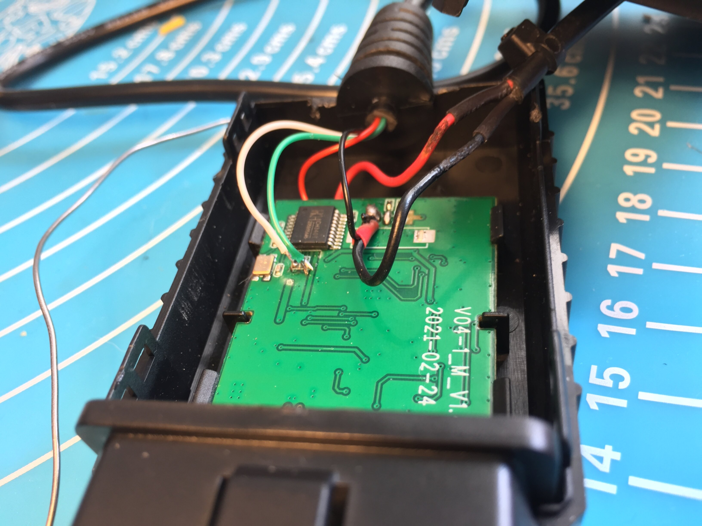
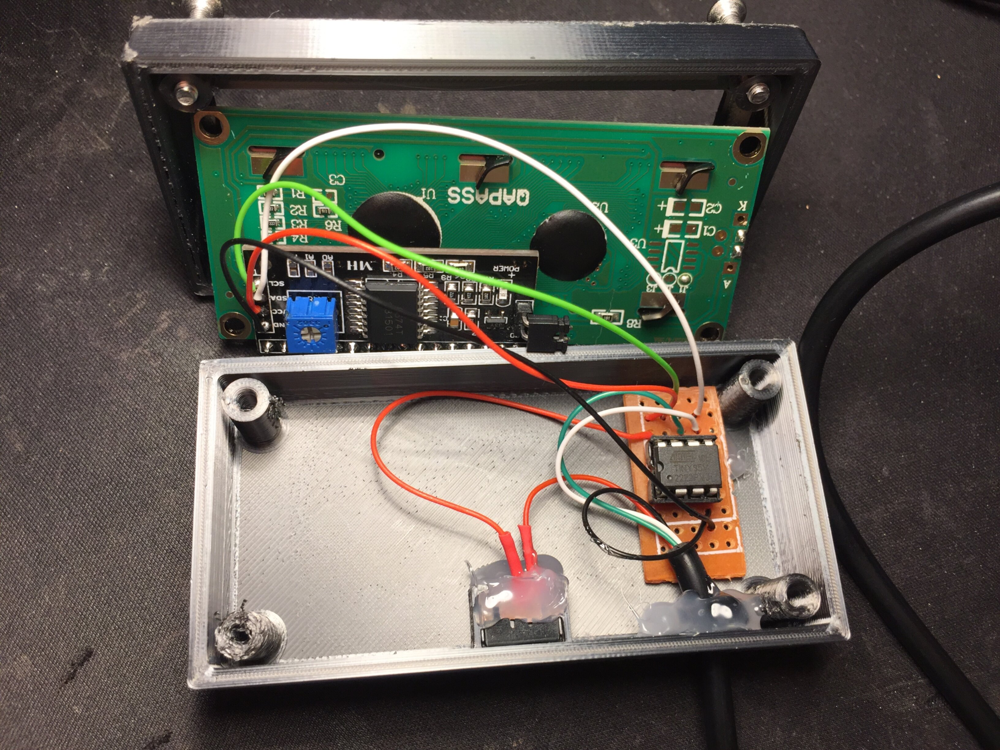

# avr-obd

Display OBD statistics on a 16x2 LCD display using an attiny85.

This project hijacks the tx and rx serial lines on a conventional ELM327 OBD interface device to send and retreive data. This data is then displayed in a nice format on an LCD1602 via i2c.

<p align="center">
    
    
</p>
<p align="center">
    
    
</p>

## Compiling and programming

An AVR programmer of choice can be used to program the attiny85, however a really easy way to achieve this is by using a spare raspberry pi as an SPI programmer. See the following blog post by Kevin Cuzner on how to set this up:

https://web.archive.org/web/20220629132626/http://kevincuzner.com/2013/05/27/raspberry-pi-as-an-avr-programmer/

Assuming that the linuxspi programmer is being used on a raspberry pi, the steps are:

### Configure the linuxspi programmer

The linuxspi programmer has a reset function that can drive the reset pin on the AVR device low to enable SPI programming. To enable this feature the following config should be placed at `/root/.avrduderc`:

```text
programmer
  id = "linuxspi";
  desc = "Use Linux SPI device in /dev/spidev*";
  type = "linuxspi";
  reset = 22;
;
```

### Connect Raspberry pi to attiny85

The following pinout should be followed:

| Rasp pi | attiny85 |
|---------|----------|
| GPIO 22 | PB5      |
| GPIO 10 | PB0      |  
| GPIO 09 | PB1      |  
| GPIO 11 | PB2      |  

### Run the Makefile

The makefile will build each *.c file under `src/` and then link them, it can also call avrdude to perform the spi copy.

```bash
cd src/avr-obd
make install
```